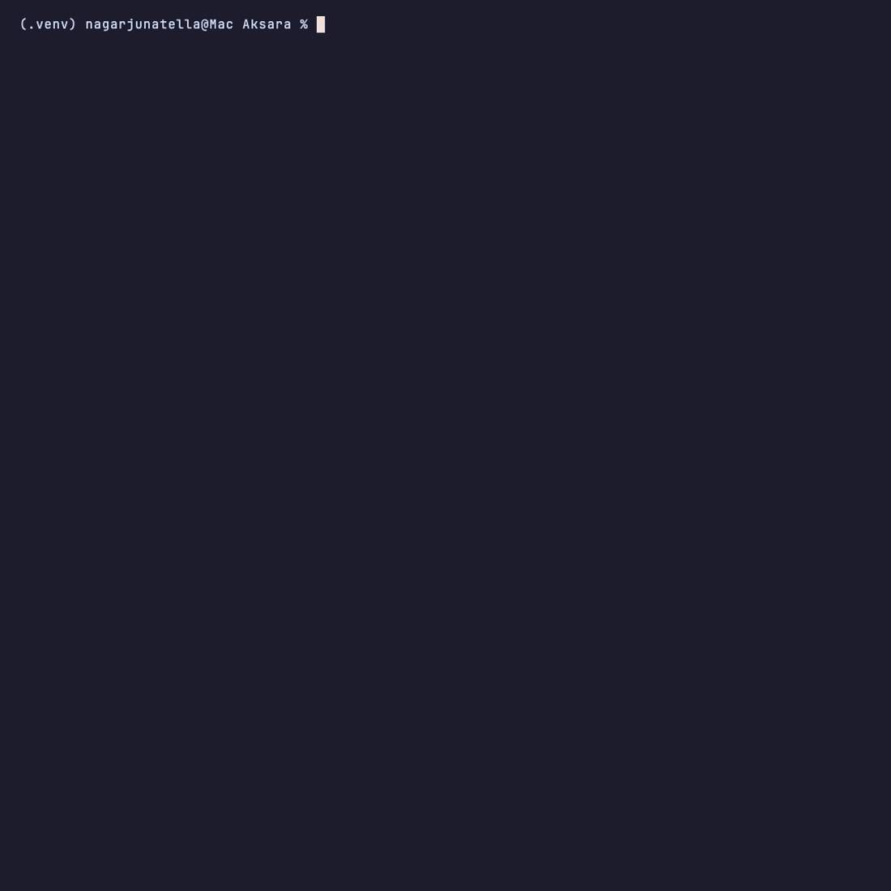

# Aksara Framework

## Async Python Backend — ORM, Auto-REST, Admin, Diagnostics, and MCP

<div class="hero-section" markdown>

**Aksara** is a Python backend framework for PostgreSQL applications. Define
your models and get migrations, generated REST APIs, Admin, diagnostics, and a
permission-filtered MCP tools from the same codebase.

[Get Started →](quickstart.md){ .md-button .md-button--primary }
[View on GitHub](https://github.com/nagarjuna-tella/Aksara){ .md-button }

<p align="center" style="margin-top: 1.5rem;">
  
</p>

</div>

!!! info "v0.6.0 Production Mode contract"
    The v0.6 release supports production use within its documented backend
    contract. Studio, AI analysis/provider surfaces, process-local
    investigation sessions, and autonomous agents remain experimental. The
    Generated tools are available through an official-SDK MCP Streamable HTTP
    server at `/mcp/`. Read the [stability and production contract](roadmap/v0-6-stability-contract.md).

---

## What is Aksara?

**Aksara gives you everything out of the box:**

| What You Get | How |
|--------------|-----|
| **Async ORM** | Define Python models → Aksara creates database tables and handles all SQL |
| **Auto REST API** | One `ModelViewSet` class → full CRUD endpoints with pagination and validation |
| **Real-Time Streams** | Every `ModelViewSet` can expose `GET /<prefix>/stream` for live model events |
| **Built-in Admin** | Browse and edit your data at `/admin` with zero configuration |
| **Studio UI** | Visual dashboard at `/studio/ui` — inspect models, routes, queries, and migrations |
| **AI Console** | Natural-language interface inside Studio — ask questions about your data, routes, and schema in plain English |
| **AI Review Tools** | Run AI Debugger, Architecture Review, and Performance Analyzer against the same live project context |
| **MCP server** | Permission-filtered generated tools over Streamable HTTP at `/mcp/` |
| **Doctor & Fix Plans** | `aksara doctor` checks app health and `aksara doctor fix-plan` prints the remediation path |
| **Migration System** | Schema changes tracked and applied with `aksara migrate` |
| **TypeScript SDKs** | `aksara generate sdk --language typescript` emits a fetch-ready frontend client |
| **Native Multi-Tenancy** | `TenantModel` and PostgreSQL RLS keep tenant data isolated at the database layer |

---

## Who is Aksara For?

**Aksara is for Python developers who:**

- ✅ Want a complete backend stack, not just a web framework
- ✅ Need async PostgreSQL without writing raw SQL
- ✅ Like Django's ergonomics but want FastAPI's async performance
- ✅ Want a generated, permission-filtered operation catalog for AI adapters
- ✅ Value built-in tooling (Studio, AI Console, Doctor) over plugin sprawl

**You don't need:**

- ❌ Previous Django or FastAPI experience
- ❌ Deep database knowledge
- ❌ To configure AI integrations from scratch

---

## How Does It Work?

```
You write this:                    You get this:

┌──────────────────────┐           ┌──────────────────────┐
│ class Task(Model):   │           │ Database table       │
│   title = String()   │    ──►    │ with columns         │
│   completed = Bool() │           │                      │
└──────────────────────┘           └──────────────────────┘

┌──────────────────────┐           ┌──────────────────────┐
│ class TaskViewSet(   │           │ REST API endpoints:  │
│   ModelViewSet):     │    ──►    │ GET  /tasks/         │
│   model = Task       │           │ POST /tasks/         │
└──────────────────────┘           │ GET  /tasks/{id}/    │
                                   │ PUT  /tasks/{id}/    │
                                   │ DELETE /tasks/{id}/  │
                                   └──────────────────────┘
```

**In ~10 lines of code, you get:**

- A database table
- A complete REST API
- Input validation
- Interactive documentation
- Admin interface

---

## Quick Example

Here's a complete working API:

```python
# main.py
from aksara import Aksara, Model, fields
from aksara.api import ModelViewSet

# 1. Define your data structure
class Task(Model):
    """A task in a todo list."""
    title = fields.String(
        max_length=200,
        ai_description="Short title describing the task",
    )
    completed = fields.Boolean(
        default=False,
        ai_description="Whether the task has been finished",
    )
    created_at = fields.DateTime(auto_now_add=True)

# 2. Create the API
class TaskViewSet(ModelViewSet):
    model = Task

# 3. Start the app
app = Aksara(database_url="postgresql://localhost/myapp")
app.include_viewset(TaskViewSet, prefix="/tasks")
```

**Run it:**

```bash
aksara dbsetup    # Set up the database interactively
aksara migrate    # Create the database table
aksara dev        # Start the development server
```

**Test it:**

```bash
# Create a task
curl -X POST http://localhost:8000/tasks/ \
  -H "Content-Type: application/json" \
  -d '{"title": "Learn Aksara"}'

# List all tasks
curl http://localhost:8000/tasks/
```

Once running, open **http://localhost:8000/studio/ui** for local development
inspection. The `ai_description` metadata also flows to generated MCP tools at
`/mcp/`. Studio and AI Console remain experimental in v0.6.

---

## Key Features

### 🗄️ Database Without SQL

Define your data as Python classes. Aksara handles the SQL.

```python
class Article(Model):
    title = fields.String(max_length=200)
    content = fields.Text()
    published = fields.Boolean(default=False)
    created_at = fields.DateTime(auto_now_add=True)

# Query without SQL
articles = await Article.objects.filter(published=True).order_by("-created_at")
```

**What this means:** You work with Python objects, not database queries.

👉 [Learn about Models](orm/models.md)

---

### ⚡ Fast Async Performance

Every database call is non-blocking. Your app can handle many requests at once.

```python
# All database calls use await
article = await Article.objects.get(id=article_id)
articles = await Article.objects.filter(published=True)
```

**What this means:** Your server doesn't freeze while waiting for the database.

---

### 🔌 Automatic API Creation

One class creates a complete REST API with all standard operations.

```python
class ArticleViewSet(ModelViewSet):
    model = Article
    permission_classes = [IsAuthenticated]
```

**What you get automatically:**

| Method | URL | What It Does |
|--------|-----|--------------|
| GET | `/articles/` | List all articles |
| POST | `/articles/` | Create an article |
| GET | `/articles/{id}/` | Get one article |
| PUT | `/articles/{id}/` | Update an article |
| DELETE | `/articles/{id}/` | Delete an article |

👉 [Learn about ViewSets](api/viewsets.md)

---

### 🔒 Built-in Security

Control who can access what with simple permission classes.

```python
from aksara.permissions import IsAuthenticated, IsAdminUser

class ArticleViewSet(ModelViewSet):
    model = Article
    permission_classes = [IsAuthenticated]  # Must be logged in
```

**What this means:** Unauthorized requests are automatically rejected.

👉 [Learn about Security](security/overview.md)

---

### 🤖 AI integration experiments

Make your application accessible to AI assistants like ChatGPT.

```python
from aksara.ai import build_full_ai_context

# Export your entire app as structured data for AI
context = await build_full_ai_context(app)
```

**What this means:** application code can build structured context for a
human-controlled AI integration. The context schema is not an authorization
control.

The same experimental AI layer powers Studio AI Console, Architecture Review,
and Performance Analyzer.

👉 [Learn about AI Mode](ai-mode/index.md)

---

### 🛠️ Admin Dashboard

A built-in interface to view and manage your data.

```python
app = Aksara(
    database_url="postgresql://localhost/myapp",
    enable_admin=True,  # Enable admin at /admin/
)
```

**What you get:** A web interface to browse, create, edit, and delete data.

👉 [Learn about Admin](admin/index.md)

---

## Installation

```bash
pip install aksara-framework
```

**Requirements:**

| Tool | Supported Version | What It's For |
|------|-------------------|---------------|
| Python | 3.11–3.14 | Both endpoints run in the release matrix |
| PostgreSQL | 16 in release CI; 18.4 in the packaged-app gate | Storing your data |

👉 [Full Installation Guide](getting-started/installation.md)

---

## Next Steps

<div class="grid cards" markdown>

-   :material-rocket-launch:{ .lg .middle } **Quickstart**

    ---

    Build your first API in 5 minutes.

    [:octicons-arrow-right-24: Start Building](quickstart.md)

-   :material-school:{ .lg .middle } **Getting Started Guide**

    ---

    Detailed walkthrough for beginners.

    [:octicons-arrow-right-24: Learn Step by Step](getting-started/index.md)

-   :material-database:{ .lg .middle } **Models & ORM**

    ---

    Learn how to define and query data.

    [:octicons-arrow-right-24: Learn about Data](orm/index.md)

-   :material-api:{ .lg .middle } **API Layer**

    ---

    Build REST APIs with ViewSets.

    [:octicons-arrow-right-24: Learn about APIs](api/index.md)

</div>

---

## v0.6.0 Production Mode

- **Production contract** — stable, experimental, and unsupported surfaces are
  explicit.
- **Production reference app** — the packaged support desk example exercises
  migrations, generated APIs, auth, permissions, forced-RLS tenancy, scoped
  catalog-described mutation, tasks, Admin, Doctor, failure, and recovery.
- **Release diagnostics** — `production-check --release` fails on any non-pass
  result and requires a complete security matrix.
- **Compatibility matrix** — Python 3.11/3.14 and both FastAPI/Starlette
  dependency boundaries run the full suite.

[Full changelog →](changelog.md)

---

## Getting Help

- **Documentation** — You're reading it!
- **GitHub Issues** — [Report bugs or request features](https://github.com/nagarjuna-tella/Aksara/issues)
- **Discussions** — [Ask questions](https://github.com/nagarjuna-tella/Aksara/discussions)

---

<div class="footer-tagline" markdown>

**Aksara** — *Simple, fast, AI-ready backends for Python.*

Designed and built by [Nagarjuna Tella](https://github.com/nagarjuna-tella).

</div>
