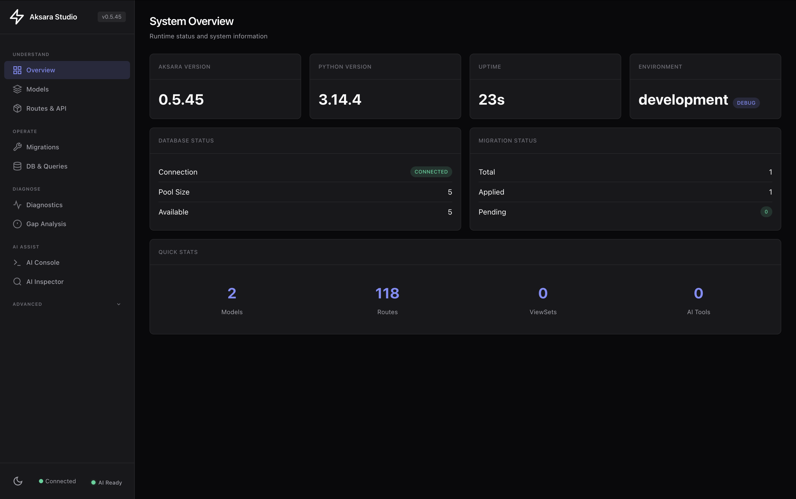

# Aksara Studio

!!! warning "Experimental development surface"
    Studio's UI and internal APIs are experimental in v0.6 and are not the
    production administration contract. Keep Studio disabled in production.
    Use generated REST APIs, your application permissions, and the built-in
    Admin where appropriate for operational workflows.

Aksara Studio is an optional built-in web UI distributed with Aksara. It runs
inside an application only after Studio is explicitly enabled.

Enable it with the settings below, start the app with `aksara dev`, then open
**http://localhost:8000/studio/ui**.

## What is Aksara Studio?

Studio is a visual dashboard embedded in your Aksara application. It gives you a live view of everything happening in your backend:

- **Model Browser** — Explore your database schema and field definitions
- **Query Explorer** — Inspect live queries, query plans, and N+1 alerts
- **Migration Manager** — View pending and applied migrations
- **API Inspector** — Browse your auto-generated REST endpoints
- **AI Console** — Ask questions about your data in plain English
- **Runtime Panel** — View settings, connection pool status, and health checks

!!! info "Studio docs vs AI Mode docs"
    Read the Studio docs for the built-in web UI, Studio endpoints, and Studio configuration.
    Read [AI Mode](../ai-mode/index.md) for the AI Console, AI Flows, MCP tools,
    AI Debugger, Architecture Review, and Performance Analyzer that run inside Studio
    or connect to external agents.

## Quick Start

### 1. Enable Studio explicitly

Studio defaults to disabled, including in debug mode. Set a local secret before
constructing the app:

```dotenv
AKSARA_ENABLE_STUDIO=true
AKSARA_STUDIO_SECRET_TOKEN=replace-with-a-random-local-secret
AKSARA_STUDIO_REQUIRE_AUTH=false
```

### 2. Start Your App

```bash
aksara dev
```

### 3. Open Studio in Your Browser

Navigate to **http://localhost:8000/studio/ui**

That's it. Studio reads your app's live state — models, routes, queries, and migrations — all from the same process.


*Studio System Overview — framework version, Python runtime, database connection pool, migration health, and live project statistics in one view.*

### 4. Studio API Endpoints

Studio also exposes a JSON API used by the UI. These are available while your app runs:

| Endpoint | Description |
|----------|-------------|
| `GET /studio/handshake` | Full project schema and route manifest |
| `GET /studio/context/summary` | Lightweight schema summary |
| `GET /studio/health` | Database and service health check |

### 5. CLI Utilities

```bash
# Test the handshake endpoint from the terminal
aksara studio handshake

# Print Studio endpoint URLs for your running app
aksara studio url
```

## Documentation

<div class="grid cards" markdown>

-   :material-api: **[Studio API](api.md)**

    ---

    Complete API reference for Studio endpoints

-   :material-console: **[CLI Commands](cli.md)**

    ---

    Command-line tools for Studio integration

-   :material-cog: **[Configuration](configuration.md)**

    ---

    Settings and environment variables

-   :material-robot: **[AI Mode](../ai-mode/index.md)**

    ---

    Console, flows, MCP tools, and AI analysis features

</div>

## Security

By default, Studio endpoints are disabled in every environment. In production:

1. Leave `enable_studio=False` to keep Studio unmounted.
2. To expose it deliberately, set both `enable_studio=True` and
   `studio_expose_in_production=True`, require authentication, and restrict
   origins and network access.

```python
# Enable in production (requires explicit flag)
from aksara.conf import configure

configure(
    enable_studio=True,
    studio_secret_token="replace-with-a-random-secret",
    studio_expose_in_production=True,
    studio_require_auth=True,
    studio_auth_token="replace-with-a-separate-bearer-secret",
    studio_allowed_origins=["https://studio.mycompany.com"],
)
```

## Next Steps

- [Studio API Reference](api.md) - Detailed endpoint documentation
- [CLI Commands](cli.md) - Test and manage Studio from the terminal
- [Configuration](configuration.md) - Security and settings
